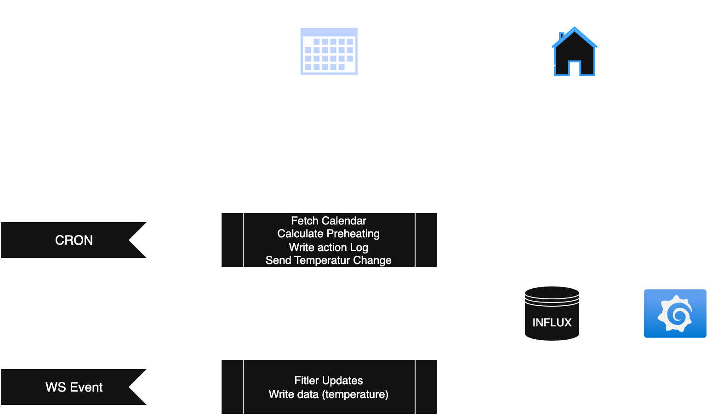

# ChurchTools Integration for Homematic IP
## Core idea
### CRON based heating
This service is a connection Module between the [ChurchTools Calendars](https://heidelsheim.church.tools/?q=churchcal#CalView/) and the Homematic IP Access Point in the community hall. In ChurchTools, events can be created that have bookings for rooms. When a room is booked (in winter, or on cold days), the heating units in a booked room should heat the room to a predefined temperature. For this, the current temperature of the room is analyzed and combined with the desired temperature and the heating rate of the room.

Every X Minutes (see cron definition), for each near event with a room booking, the current heating rate is calculated. If the required time to heat is lower than the time until the event, the heating for this specific room is triggered.
### Monitoring
In addition to the cron job, the service is connected to the Homematic IP Server via WebSocket. On this WebSocket channel, updates about the state of the Home (devices and their set or current temperatures, humidity etc.) is published on change. Each relevant change is published as datapoint into [Influx](https://influx.smarthome.cg-heidelsheim.de/). The historic data is visualized in a [Grafana Dashboard](https://grafana.smarthome.cg-heidelsheim.de/d/DZJ-FUKnz/heizungsgruppen?orgId=3). This not only includes data about e.g. temperatures, but also logs produced by the script, so that proper insight into the script and its actions can be reviewed. [Grafana Log Dashboard](https://grafana.smarthome.cg-heidelsheim.de/d/A-73UbcVk/logging?orgId=3&refresh=5s).
## Overview (flow)

## Detailed Functionality
### Cron Job
#### Midnight Reset
When the cron is executed at midnight, a reset is executed. For this, each room, that was left changed manually, it is reset back to its base temperature (usually 16°C). 

To check if a room was left changed manually, it is checked if a room lock exists. If a lock exists, an automatic change for an event was executed, and no manual change was made.
In that case, the room is flagged, so that on the next cron execution the reset will be attempted again.

When a room is not locked, the default temperature is loaded for the room. The heating will be set to the specified temperature in homematic.

The midnight reset is executed a maximum of 3 times (for each iteration). This is because it might be that the connection info (like server URL) has changed. If that's the case, the info is reloaded and the reset retried. This is not the retry for a room that is locked! On Tripple failure, an error is sent to uptime kuma. 

#### Resolve Locks
Foreach room, the lock state is checked. A lock specifies, if the preheating cycle for a room was executed and thus an event is taking place in this room. The lock prevents further automatic changes from happenning.
```json
{
    "groupId": "Godi-Saal",
    "expiring": "<DATE>",
    "eventName": "Bandprobe"
}
```
For each lock, the expiration is checked. If the current date is past the expiration date, the lock will be deleted. Additionally, the room temperature will be set to IDLE (default 16°C).  

#### Fetch Events
For a specified set of calendars (referenced by ID in the .env), calendar events are loaded from the ChurchTools API. 

#### Event Handling
On start, only active or future events will be processed. Passed events might still be in the event list, but will be discarded.
Also, events with no room bookings are ignored.

For current or future events with bookings, the required time to heat will be calculated for each of the bookings independently. Note that a booking has to be "accepted" (`status_id = 2`)

If a room is locked, no further processing happens for this room.

For a given booking/room, the heating rate is calculated. This is done by analyzing the current temperature for the room, and the desired temperature. For a room, a spinup time is respected. This time indicates how long the heating element takes for the first changes to happen in a room. This means how long until the radiators get warm, as well as the first changes of temperature to be felt in the room (this depends on the size). In addition to that (whilst not being scientifically accurate), a `minutesPerDegree` is used to defined how long a room takes to heat (depends on the size). This variable is filled by analyzing past data. 
In total, we have `requiredTime = spinupTime + (degreeDifference * minutesPerDegree)`.
If the `requiredTime` in minutes is bigger than the minutes until the event takes place, a temperature change for the room is executed. Note that heating is only executed, if no manual change was made. The system respects manual changes and does not override them. Heating thus is blocked and attempted in the next cycle. On successful heating start, a lock for the room is created.

### Websocket Events
Each websocket message is filtered. Only three different message types are currently respected.  
#### Handle Group Message
A group message indicates, that e.g. a heating group (room) has changed. If the group is no heating group, the message is discarded. 
For normal heating groups, the last known state is loaded. The new state is compared to the old state. On difference, an updated dataset is sent to Influx, and the new state is persisted on disk.
#### Handle Device Message
A device message indicates, that a device (with inbuilt sensors) has changed. If the device is no heating thermostat, the message is discarded.
For normal heating thermostats, the last known state is loaded. The new state is compared to the old state. On difference (checked for each channel of the device, usually just one channel), an updated dataset is sent to Influx, and the new state is persisted on disk.
#### Handle Home Message
A home message indicates, that general home data like the weather has changed. 
For the location, the last known state is loaded. The new state is compared to the old state. On difference an updated dataset is sent to Influx, and the new state is persisted on disk.

## DB Specifications
- config roomConfigurationDB.getByChurchtoolsId(booking.resource_id);
- lock
- pendiglog
- device state
- group state

# FAQ
## Room heating did not start
- Was there an actual booking of the room? 
- Is the room booking status accepted `status_id = 2`
- Is the room common, or is there a room that doesn't exist in Homematic? 